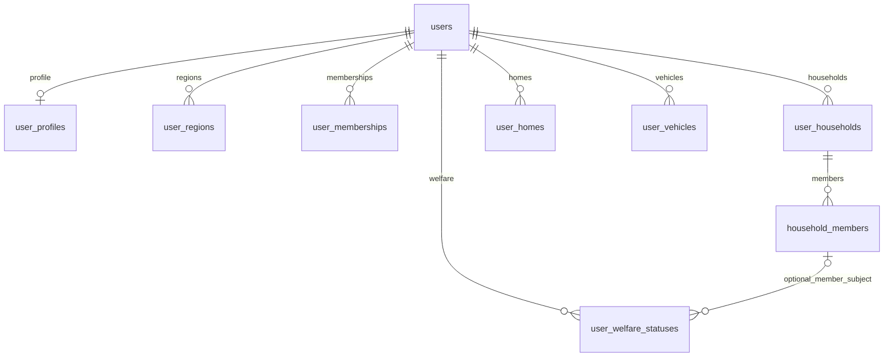

# DB 스키마와 재현 검사

제도·행동·조건·출처 조회와 사용자 사실 저장을 검증한 SQL 묶음이다. PostgreSQL18.6에서 카탈로그129개, 기본 사용자55개, 상세56개를 검사한다. 실제 서버/Flyway에 연결하기 전의 검증본이며 앱 실행 시 자동 적용하지 않는다.

## 구성

| 파일 | 역할 |
|---|---|
| `lookup-schema.sql` | 제도·행동·조건·출처·공통 범주·구별/장소 관계와 `benefit_lookup` |
| `user-storage.sql` | 프로필·지역·가입3테이블, 입력 정의/매핑과 `user_benefit_context` |
| `detail-storage.sql` | 세대·세대원·수급·주택·차량5테이블, 상세 매핑과 `user_detail_context` |
| `action_links.json` | 원본 조건→행동 연결. 단순 대상 정보와 적격성 판정을 구분 |
| `user-input-schema.json` | 기본 입력 키·서비스·대표 조건 연결 계약 |
| `detail_mapping.py` | 상세 입력 키·수급 유형·대표 조건 연결 데이터 |
| `fixtures/catalog/` | 2026-09-17 공개 제도 조사 스냅샷. URL·확인수준·미확인 상태 보존 |

사용자 정보 테이블은8개다. 인증 사용자와 지역·서비스·수급종류 참조표, 조건 연결표는 이 개수에 포함하지 않는다.



기준값·AND/OR·출처는 혜택에 두고, 사용자의 사실은 해당 주체·서비스·세대원·주택·차량에 연결한다. 가입 행 없음은 미확인이고 명시적 false는 미가입이다. 본인 생년월일과 수급은 다른 테이블에 복제하지 않고 조회할 때 재사용한다. 요청별 품목·수량·신청 건과 운영시간·참여기업 목록을 개인 프로필에 저장하지 않는다.

## 재실행

Python3 표준 라이브러리, Docker 및 `postgres:18.6-bookworm` 이미지가 필요하다. 필요한 경우 먼저 `docker pull postgres:18.6-bookworm`으로 이미지를 준비한다. 검사 자체는 `--pull never`로 캐시 이미지를 사용한다.

저장소 루트에서:

```sh
PYTHONDONTWRITEBYTECODE=1 python3 database/test_detail_storage.py
```

이 명령은 카탈로그 구성/129검사 → 기본 사용자 구성/55검사 → 상세 구성/56검사를 하나의 새 DB에서 차례로 실행한다. 부분 검사는 `database/run_lookup.py`, `database/test_user_storage.py`로 실행한다.

실행 결과는 Git에서 제외되는 `.local/db-verification/`에 남긴다. 다른 위치가 필요하면 `ECO_DB_REPORT_DIR`를 지정한다. `detail-storage-result.json`에는 전체 검사·실행 해시·정리 결과가 있고, `user-storage-check.json`·`detail-storage-check.json`에는 해당 검사와 합성 조회 예시가 있다. `verification.json`은 이 저장소에 옮긴 파일로 실행한 결과의 요약이다.

검사는 `eco-db-schema-validation` 컨테이너를 네트워크/호스트 포트/기존 볼륨 연결 없이 tmpfs로 만든다. 같은 이름이 이미 있으면 재사용하거나 지우지 않고 중단한다. 정상 종료와 예외 발생 시 자신이 생성한 컨테이너 ID를 제거한다. 강제 프로세스 종료나 호스트 장애 시에는 남은 해당 컨테이너를 확인해야 한다. 테스트 코드의 사용자 UUID·세대원·주택·차량 값은 모두 합성 자료다.

## 확인 범위

- 카탈로그69행: 일반 제도28 + 구별 후보41. 중복 제거한69개 제도라는 뜻은 아니다.
- 행동/후보106, 원본 조건263, 행동–조건337연결, 출처106행을 조회한다.
- 기본 사용자 입력45연결과 상세59연결은 대표 조건을 행동별로 펼친 값이다. 모든 조건의 개인화 입력을 구현한 것은 아니다.
- 장소는 노원7개와 영등포 변경2개 예시다. 전체 장소·실시간 운영·공식 행정코드 전수 검증은 아니다.
- 사용자별 분리, 수정·삭제·미확인, 세대원 주체 보존, 주택/차량 선택, 잘못된 키·타입·참조 거부를 검사한다.

조회 결과는 `eligibility_status=not_evaluated`다. 조건 입력을 연결했다고 전체 정책의 적격성이 판정된 것은 아니다. 세대원 입력은 `value_shape=by_member`이고, 각각의 ID·등본 포함 여부·값을 보존한다. 세대/주택/차량 ID를 선택하지 않으면 `not_selected`로 반환한다.

## 실제 앱 연결 전에 할 일

1. 시험용 `users(id uuid)`와 `test:` 지역 참조를 실제 인증 사용자·공식 지역 참조표와 맞춘다. 이 bootstrap은 테스트 코드 안에만 있다.
2. SQL을 [Flyway 위치](../backend/src/main/resources/db/migration/README.md)의 버전 마이그레이션으로 옮기고 의존성/설정·빈 DB와 변경 적용을 검사한다. 지금 파일은 Flyway 적용 완료본이 아니다.
3. `profile`·`catalog` 모듈에서 저장·조회 포트와 인증된 사용자 소유권 검사를 연결한다. 현재 테스트는 SQL의 사용자 ID 분리이며 앱 API 권한 검사는 아니다.
4. 그 뒤 모델의 구조화된 사용자 답변을 저장 경로에 연결하고 대화 QA를 진행한다.

현재 값 저장 구조로, 과거 상태 복원·필드별 장기 이력·부하·정책 최신성 전수 검증은 포함하지 않는다. 실제 개인정보·테스터 로그·운영 DB 덤프는 이 디렉터리에 넣지 않는다.
