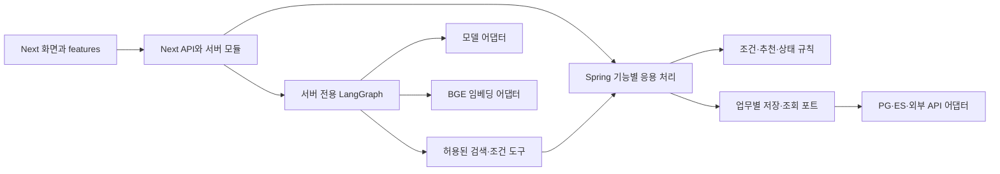

# 팀 구현 뼈대와 책임 경계

## 현재 기준

기능을 채우기 전에 합의한 아키텍처의 코드 틀부터 정리한다. Next TypeScript는 AI·LangGraph·도구 연결을, Spring은 HTTP API·업무 규칙·SQL/DB·권한을 맡는다. Next는 Spring HTTP API를 호출하고 DB를 직접 조회하지 않는다. DDD는 기능별 책임을 묶는 기준, SRP는 변경 이유가 다른 책임을 나누는 기준으로 적용하며 외부 접근은 헥사고날의 포트/어댑터 경계로 분리한다.

검증한 [DB 파일](../database/README.md)은 `3b5fd2c`로 저장소에 반영돼 있다. 해당 전체 구성을 [팀 개발 DB](../database/development.md)의 Flyway V1/V2에 연결했다. 회원·사용자 조건·공개 catalog 조회 API까지 구현했다. 새 대화 실행부의 채팅 API 연결은 아직이다. 사용자 정보 수명·조건 비교 범위·구체적인 요청/응답 필드는 DB와 실제 기능을 연결할 때 정한다.



그림은 전체 구현 목표다. 현재 상태 조회·회원 세션·사용자 조건 조회·공개 catalog 검색/상세 API와 Next 도구를 구현했다. AI 실행 골격과 BGE 어댑터도 있으며 ES 검색·추천·업무 상태 변경은 아직 연결하지 않았다. 기존 `/api/chat`·장소·지도 API는 main에 있던 FastAPI 연결을 유지하며 새 구조로 연결한 상태가 아니다.

## Spring 기능 위치

기준 경로: `backend/src/main/java/kr/co/ecojupjup/`.

| 패키지 | 책임 | 후속 연결 |
|---|---|---|
| identity | 인증·세션·요청 사용자 식별 | 기존 세션 구현됨; profile controller 상수 역의존 정리 필요 |
| profile | 관심사·채택한 사용자 사실·정정 | 사용자정보 DB와 입력 계약 |
| catalog | 제도·행동·조건·출처와 지원하는 조건 비교 규칙 | 자료 관계·상세 조회·비교 지원 범위 |
| search | 허용 필터·키워드/벡터 후보 검색 | PG/ES 투영·지역·ID 계약 |
| recommendation | 후보 제외·정렬·발견·추천 이유 | profile/catalog/activity의 필요한 읽기 |
| conversation | 대화 소유권·보존할 결과·중복 방지 기록 | 저장 정책; 그래프 노드·호출 상태는 Next 책임 |
| places | 정규 지역 검사·지도 후보·장소 조회 | 지역·장소 매핑; 자연어 해석·모델 후보 선택은 Next |
| activity | 노출·조회·자기보고 실천 사건 | 중복 방지·집계·소유권 |
| health | 실제 PG 연결 상태 | 현재 구현 예시 |
| common/api | 공통 응답·오류·요청 ID | 현재 구현됨 |

기능 패키지는 `package-info.java`로 위치와 책임을 표시하며 identity/profile/catalog/health에는 실제 구현이 있다. 한 Spring 서버 안의 모듈이며 각각 별도 서버를 만들지 않는다. 빈 컨트롤러·서비스·repository와 임의의 성공/빈 목록 API는 만들지 않는다. 실제 기능을 구현할 때 해당 모듈 아래 필요한 부분만 추가한다.

```text
<feature>/api/          요청·응답 변환, 인증된 호출 문맥 전달
<feature>/application/ 사용 사례, 순서·트랜잭션, 필요한 저장/조회 포트
<feature>/domain/      조건·점수·상태 전이 등 핵심 규칙
<feature>/adapter/     JDBC·ES·외부 서비스와 내부 모델 변환
```

핵심 규칙은 HTTP·DB·모델 SDK·환경변수를 직접 읽지 않는다. 응용 처리는 포트를 사용하고 어댑터가 이를 구현한다. 다른 모듈의 컨트롤러·테이블·JDBC 구현을 직접 호출하지 말고 필요한 응용 인터페이스로 연결한다. 작은 기능은 함수/클래스 하나로 충분하며 인터페이스를 기계적으로 추가하지 않는다. 예시인 health에도 업무 저장 계약을 억지로 끼워 넣지 않는다.

현재 `health/api/HealthController` → `health/application/HealthService`·`DatabaseProbe` → `health/adapter/JdbcDatabaseProbe`가 실행 가능한 참조 구조다. health에는 업무 판단 규칙이 없으므로 빈 domain 계층을 추가하지 않는다. 챗 도구와 일반 화면에서 필요한 같은 기능은 Spring의 같은 응용 서비스로 연결한다.

### 암호화 사용자 사실 저장

공유 `profile.facts` 패키지는 다른 저장 담당과 맞춘 포트/값 계약을 유지한다. 기본 주입되는 `application.PrivateFactsService`가 쓰기 트랜잭션을 열고, 같은 포트의 내부 persistence 구현인 `adapter.JdbcPrivateFactsStore`에 저장을 맡긴다. JDBC 구현은 잠금·암호화 행 병합·제약/참조 확인·SQL을 담당하며 트랜잭션 없는 직접 쓰기를 거절한다. 외부 호출자는 persistence qualifier를 사용하지 않는다.

기존 `application.ConditionContextService`가 조건 조회 전체의 read-only REPEATABLE_READ 경계를 열고 `adapter.JdbcConditionContextLookup`이 공개 매핑과 필요한 개인 사실을 읽는다. 암호 연산/키링과 유지보수 migration은 기술 경계 안에 남는다. [계약·이관 설명](private-facts-storage.md).

## Next 기능 위치

| 위치 | 현재 또는 예정 역할 |
|---|---|
| `frontend/src/app` | 기존 화면과 HTTP 진입점 |
| `frontend/src/features/profile` | 가입·관심사·프로필 UI/상태를 옮길 위치 |
| `frontend/src/features/missions` | 미션 표시·선택·실천 입력 위치 |
| `frontend/src/features/chat` | 대화 UI·전송 상태 위치 |
| `frontend/src/features/map` | 지도·장소 표시/선택 위치 |
| `frontend/src/lib/server/spring-client.ts` | 공통 Spring HTTP 요청·응답 검증·오류 변환 |
| `frontend/src/lib/server/health.ts` | 공통 클라이언트를 쓰는 현재 health 호출 함수 |
| `frontend/src/lib/server/ai/runtime.ts` | 환경값을 읽고 실제 구현을 조립하는 진입점 |
| `frontend/src/lib/server/ai/application/search-answer-flow.ts` | 현재 LangGraph 검색/답변 흐름 |
| `frontend/src/lib/server/ai/application/condition-memory.ts` | DB 초기값·대화 변경값·대상/건별 조건 메모리. 새 대화 실행부에 연결 |
| `frontend/src/lib/server/ai/contracts.ts` | 모델·임베딩 함수 계약, 근거 자료와 AI 오류 |
| `frontend/src/lib/server/ai/tools/contracts.ts` | 기존 고정 검색 그래프의 주입 계약; 공개 업무 도구는 catalog-tools.ts |
| `frontend/src/lib/server/ai/adapters` | OpenAI·BGE SDK/HTTP 접근과 응답·오류 변환 |

features에는 책임 안내와 [API 경로 위치](api-skeleton.md)를 두었으며 기존 화면은 아직 이동하지 않았다. 기능을 실제 연결할 때 컴포넌트·훅·화면용 요청 코드를 분리한다. DB 레코드나 모델 SDK 타입을 그대로 브라우저 계약으로 사용하지 않는다. 회원 API의 인증 쿠키 중계와 사용자 조건 조회의 소유권 확인은 구현했다. 상담별 소유권·보관 계약은 후속이다.

그래프는 계약만 알고 어댑터를 직접 생성하지 않는다. `runtime.ts`가 모델·임베딩 어댑터와 호출자가 제공한 도구를 조립한다. 도구의 Spring 연결 구현은 해당 업무 API를 만들 때 tools에 추가하고 HTTP 통신은 공통 Spring 클라이언트로 모은다. 도구마다 노드·서비스·Repository를 일대일로 만들지 않는다.

[공통 클라이언트 사용법](spring-client.md): 업무별 호출 함수가 path·입력·성공 데이터 검사를 정의하고, 클라이언트가 HTTP·요청 ID·시간 초과·공통 오류를 처리한다. health·회원·개인화·catalog 호출에 사용하며 공개/개인화 도구는 새 대화 실행부에서 조립한다.

[조건 메모리](condition-memory.md)는 DB에서 받은 초기값과 대화 중 정정값을 분리하는 JSON 상태다. 입력 정의·값 타입·대상·수명을 전달받고 순수 함수로 갱신한다. SQL 응답 변환·모델 해석·DB 저장은 이 모듈 밖에서 연결하며 현재 채팅 경로에는 아직 사용하지 않는다.

기존 `search-answer-flow.ts`는 `임베딩 → 검색 → 답변/검색 결과 없음`의 고정 골격이다. 별도 `conversation-flow.ts`에 `모델 → 도구 → 결과 → 모델/완료` 루프를 구현했다. 두 흐름은 구분하며 새 실행부의 채팅 API 연결은 아직이다.

## 대화 실행부 연결 상태

[대화 실행부](conversation-runtime.md)에 기존 QA의 model→tool→model 흐름과 성공 턴 메모리 채택을 이식했다. `createConversationRuntime`이 공개 catalog 도구·개인화 로더·OpenAI Conversations 어댑터를 조립한다. 모델/HTTP는 application에서 주입받고 SQL·회원/대상 소유권은 Spring에 유지한다. 이 실행부의 관련 단위16개·타입 검사는 통과했지만 [복원 결함과 미정 계약](conversation-runtime.md#연결-전-남은-결함과-결정)이 남아 있으며 `/api/chat`·화면은 아직 기존 경로다. 위 고정 검색 그래프 설명은 유지 중인 기존 실행 경로이고 새 대화 그래프의 API 전환은 다음 단계다.

## 오류 처리 경계

| 담당 | 책임 |
|---|---|
| Spring | 업무 입력·권한·DB 오류를 HTTP 상태와 공통 오류 코드로 반환 |
| Next 서버 | Spring 연결 실패·시간 초과·잘못된 응답, 모델·도구 실패를 변환하고 그래프의 후속 처리를 결정 |
| 프론트 화면 | 오류 표시·로딩 해제·입력 복구·재시도 안내 |

기존 `ApiResponse`의 `{data, error: {code, message}, requestId}` 형식을 사용하며 성공 시 error는 null, 실패 시 data는 null이다. 검색 결과 없음·정보 부족과 장애를 구분한다. LangGraph의 호출 한도·인수 수정·실패 종료는 Next, Spring의 트랜잭션·처리 결과 기록은 Spring 책임이다. 쓰기 요청의 시간 초과는 반영 여부를 확인하기 전 자동 재전송하지 않는다. 업무별 오류 코드와 저장 정책은 해당 기능을 채울 때 추가한다.

## DB 결과를 받을 때 맞출 지점

- **저장 원본과 검색 자료:** PG의 자료 ID·버전·관계와 ES 검색 투영을 맞춘다. 검색 결과 없음과 적재/연결 실패를 구분한다.
- **사용자 문맥:** 인증된 사용자 ID, 관심사·지역·채택 사실의 값과 미확인 의미를 정한다. 챗이 제안한 변경을 검증한 뒤 저장한다.
- **사용 사례:** 실제 조회/변경 단위부터 응용 입력·출력·저장 포트를 정한다. 저장 테이블 모양이 API 전체를 결정하게 하지 않는다.
- **적용:** `backend/src/main/resources/db/migration/`의 V1/V2로 검증한 전체 스키마와 공개 자료를 설치한다. 기존 QA V6와 다른 재구성본이며 V3 회원 계정·인증과 사용자 조건 조회까지 연결했다.
- **검사:** 실제 조회·정정·중복·소유권과 마이그레이션을 함께 검증한다. 예전 실험 스키마나 메모리 mock의 통과를 실제 DB 통합 성공으로 옮기지 않는다.

현재 `SearchTool`은 그래프 연결을 시험하기 위한 최소 포트다. 실제 검색의 필터·권한·출처·후속 조회 요구를 확인해 조정한다. 그 타입이나 임시 그래프 상태를 최종 DB/대화 설계로 고정하지 않는다. 사진·GPS 보조·추천 다양성은 기본 기능 뒤 확장하며 공식 인증과 자기보고를 구분한다.

## 현재 확인 범위와 다음 순서

기반 구조·DB·회원·개인화·공개 도구는 각 단계의 검사 기록을 가진다. 새 대화 실행부는 단위검사 범위의 진행 중 구현이며 실제 모델/API/화면 연결 완료가 아니다. 먼저 대화 보관·확정·복원 방법과 검색 종료/요청 상태 계약을 맞추고, 바뀐 경계를 검사한 뒤 채팅 API/화면을 연결한다.

과거 환경 단계의 확인 범위는 [2단계](environment-step2.md)와 [3단계](environment-step3.md)에 남긴다. 해당 단계 완료를 후속 업무 기능 완료로 해석하지 않는다.
