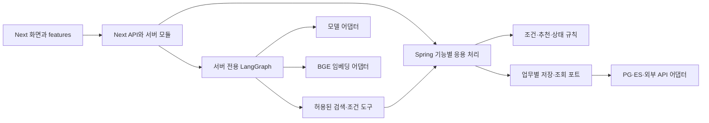

# 팀 구현 뼈대와 책임 경계

## 현재 기준

실행 환경과 기본 연결은 준비됐다. 이번4단계는 기능을 구현할 위치·책임·연결 지점을 정한다. DB는 별도로 구성/시험 중이므로 스키마·조회문·저장 포트·실제 DTO는 이 작업에서 확정하지 않는다. 디렉터리가 존재하는 것과 기능 구현 완료를 구분한다.



그림은 구현 목표다. 현재 실제로 연결된 것은 Next→Spring→PG 상태 조회, AI 모듈 검사와 BGE 상태/벡터 호출이다. 실제 검색 도구·업무 저장·인증은 아직 없다. 기존 `/api/chat`·장소·지도 API는 main에 있던 FastAPI 연결을 유지하며 새 구조로 연결한 상태가 아니다.

## Spring 기능 위치

기준 경로: `backend/src/main/java/kr/co/ecojupjup/`.

| 패키지 | 책임 | 후속 연결 |
|---|---|---|
| identity | 인증·세션·요청 사용자 식별 | 인증 방식·사용자 ID 확정 |
| profile | 관심사·채택한 사용자 사실·정정 | 사용자정보 DB와 입력 계약 |
| catalog | 제도·행동·조건·출처 상세 | 자료 관계·상세 조회 |
| search | 허용 필터·키워드/벡터 후보 검색 | PG/ES 투영·지역·ID 계약 |
| recommendation | 후보 제외·정렬·발견·추천 이유 | profile/catalog/activity의 필요한 읽기 |
| conversation | 대화 소유권·실행 상태·결과 저장 | Next 그래프와 실행/저장 계약 |
| places | 지역 해석·장소 조회 | 카카오/자료의 지역·장소 매핑 |
| activity | 노출·조회·자기보고 실천 사건 | 중복 방지·집계·소유권 |
| health | 실제 PG 연결 상태 | 현재 구현 예시 |
| common/api | 공통 응답·오류·요청 ID | 현재 구현됨 |

새8개 기능 패키지는 `package-info.java`로 위치와 책임만 표시한다. 빈 컨트롤러·서비스·repository와 임의의 성공/빈 목록 API는 만들지 않는다. 실제 기능을 구현할 때 해당 모듈 아래 필요한 부분만 추가한다.

```text
<feature>/api/          요청·응답 변환, 인증된 호출 문맥 전달
<feature>/application/ 사용 사례, 순서·트랜잭션, 필요한 저장/조회 포트
<feature>/domain/      조건·점수·상태 전이 등 핵심 규칙
<feature>/adapter/     JDBC·ES·외부 서비스와 내부 모델 변환
```

핵심 규칙은 HTTP·DB·모델 SDK·환경변수를 직접 읽지 않는다. 응용 처리는 포트를 사용하고 어댑터가 이를 구현한다. 다른 모듈의 컨트롤러·테이블·JDBC 구현을 직접 호출하지 말고 필요한 응용 인터페이스로 연결한다. 작은 기능은 함수/클래스 하나로 충분하며 인터페이스를 기계적으로 추가하지 않는다. 예시인 health에도 업무 저장 계약을 억지로 끼워 넣지 않는다.

## Next 기능 위치

| 위치 | 현재 또는 예정 역할 |
|---|---|
| `frontend/src/app` | 기존 화면과 HTTP 진입점 |
| `frontend/src/features/profile` | 가입·관심사·프로필 UI/상태를 옮길 위치 |
| `frontend/src/features/missions` | 미션 표시·선택·실천 입력 위치 |
| `frontend/src/features/chat` | 대화 UI·전송 상태 위치 |
| `frontend/src/features/map` | 지도·장소 표시/선택 위치 |
| `frontend/src/lib/server/spring-client.ts` | 현재 Spring 상태 조회 어댑터 |
| `frontend/src/lib/server/ai` | 현재 그래프·모델·임베딩·검색 도구 주입 경계 |

features에는 책임 안내와 [API 경로 위치](api-skeleton.md)를 두었으며 기존 화면은 아직 이동하지 않았다. 기능을 실제 연결할 때 컴포넌트·훅·화면용 요청 코드를 분리한다. DB 레코드나 모델 SDK 타입을 그대로 브라우저 계약으로 사용하지 않는다. 인증 쿠키 중계와 사용자 소유권 확인은 실제 사용자 API 연결 시 함께 정한다.

## DB 결과를 받을 때 맞출 지점

- **저장 원본과 검색 자료:** PG의 자료 ID·버전·관계와 ES 검색 투영을 맞춘다. 검색 결과 없음과 적재/연결 실패를 구분한다.
- **사용자 문맥:** 인증된 사용자 ID, 관심사·지역·채택 사실의 값과 미확인 의미를 정한다. 챗이 제안한 변경을 검증한 뒤 저장한다.
- **사용 사례:** 실제 조회/변경 단위부터 응용 입력·출력·저장 포트를 정한다. 저장 테이블 모양이 API 전체를 결정하게 하지 않는다.
- **적용:** `backend/src/main/resources/db/migration/`에 합의한 버전 SQL을 두고 Flyway를 연결한다. 이번에는 SQL·Flyway 의존성·엔티티를 추가하지 않았다.
- **검사:** 실제 조회·정정·중복·소유권과 마이그레이션을 함께 검증한다. 예전 실험 스키마나 메모리 mock의 통과를 실제 DB 통합 성공으로 옮기지 않는다.

현재 `SearchTool`은 그래프 연결을 시험하기 위한 최소 포트다. 실제 검색의 필터·권한·출처·후속 조회 요구를 확인해 조정한다. 그 타입이나 임시 그래프 상태를 최종 DB/대화 설계로 고정하지 않는다. 사진·GPS 보조·추천 다양성은 기본 기능 뒤 확장하며 공식 인증과 자기보고를 구분한다.

## 이번 단계 완료 기준과 다음 순서

패키지 위치와 문서 연결이 맞고 기존 실행 코드·API·DB 설정을 보존하며 Java 컴파일/기존 계약 검사를 통과하면 뼈대 정리를 마친다. 브라우저 동작·모델 품질·업무 API 구현을 이번 완료 범위에 포함하지 않는다.

다음은 DB 설계/시험 결과와 인증 기준을 받아 한 기능씩 입력/출력→응용 처리→어댑터→화면을 연결한다. 각 기능의 검증이 끝나면 main에 반영한다. 상태 조회·AI 실행 골격은 [2단계](environment-step2.md)와 [3단계](environment-step3.md)를 따른다.
